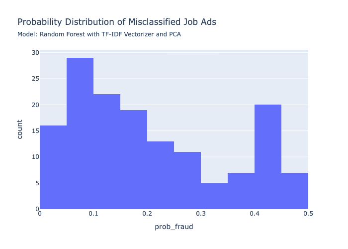

# Finding Fake Job Ads

As I get closer to applying for jobs, I am getting more and more fake jobs via messages, so I wondered how many job ads are fake?  And can I train a classification model to determine how likely a job ad is to for a fake job.  

If you are interested in exploring my model with job ads that you've found, please visit my streamlit app LINK HERE.

## Data Source, Cleaning, and Feature Extraction

The primary dataset is from [Kaggle](https://www.kaggle.com/datasets/shivamb/real-or-fake-fake-jobposting-prediction).  There are some other code posted.  I did not read these as takes all the fun out of exploring on my own first.

This an interesting dataset, although it's from Kaggle, it's actually missing quite a few values.  About 5% of the samples are fraudulent job ads.  The job ad text is broken up between four columns, I concatenated the texts together for each entry to create a single text column.  

Many of the features are large categorical data with more than 20 unique values.  This would quickly create a massive number of features, so I ended up dropping most of the categorical columns.  I did keep the categorical features with less than 20 unique values.

## Model Exploration

### Text Preprocessing
I used both the count vectorizer and the TF-IDF Vectorizer to encode the text data.  

### Principle Component Analysis

Principle Component Analysis (PCA) simply finds new coordinate system in parameter space.  It uses linear combinations of our original data to better predict the results.  This is similar to finding eigenvectors for a matrix (the features) or rescaling our original parameters by different amounts and do a crazy multi-dimensional rotation in our parameter space.  It's actually fairly straightforward linear algebra, but this is usually taught after 2-3 semesters of calculus, so not as many people get to study it.  

### Logistic Regression

The most straightforward classifier is actually locistic regression.  It's actually still a linear regression and maintains the use interpretability of linear regression.  Instead of fitting a linear equation to the target variable, we instead fit a linear equation to the _logit_ or log odds:

$$ \log \left( \frac{p(X)}{1 - p(X)} \right) = \beta_0 + \sum_{i=1}^p \beta_i x_i $$

where $X$ is our feature matrix (containing $x_1, \dots, x_p$ features), $\beta_0$ is the vector intercept or _bias_ and $\beta_1$ is the vector "slope".  Please note that I'm using the standard $\log = \ln$ is the natural log and _not_ the base-10 log.   

#### Regularization

To decrease over-fitting, we can also use regularization where we add a penalty term to our loss function, let's refer to this function as $f_\text{loss}$.

$$ f_\text{loss, regularized} =  f_\text{loss, orginal} + \lambda \left\| \beta \right\|^i_i $$

where $i$ denotes the type of normalization.  Please note that sometimes $\alpha$ is used instead of $\lambda$.  In my code, you will also see the scikit-learn notation $C = 1/\alpha = 1/\lambda$.

| Name  | Penalty          | Distance           | Equation                                                         |
| ----- | ---------------- | ------------------ | ---------------------------------------------------------------- |
| LASSO | $\ell_1$ penalty | Manhatten distance | $\left\|\| \beta \right\|\|_1 = \sum_j \left\| \beta_j \right\|$ |
| Ridge | $\ell_2$ penalty | Euclidean distance | $\left\| \beta \right\|_2 = \sqrt{ \sum_j \beta_j^2 }$           |

If you want to calculate distance using a higher dimension, this is called a Minkowski distance.  However, this is not usually helpful because it is a weaker form of regularization.  

Ridge regularization shrinks our coefficients, $\beta$.  However, LASSO (Least Absolute Shrinkage and Selection Operator) actually zeros some of the coefficients.  Sadly, using either form of regularization makes our cofficients, $\beta$, uninteretable since they are no longer just the "slopes" in our fit.

### Naive Bayes

### Random Forest

### SVC

### Other Models

## Summary