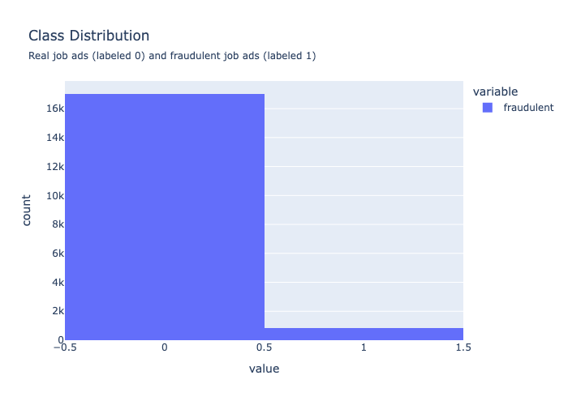

# Finding Fake Job Ads

As I get closer to applying for jobs, I am getting more and more fake jobs via messages, so I wondered how many job ads are fake?  And can I train a classification model to determine how likely a job ad is to for a fake job.  

## Data Source, Cleaning, and Feature Extraction

The primary dataset is from [Kaggle](https://www.kaggle.com/datasets/shivamb/real-or-fake-fake-jobposting-prediction).  There are some other code posted.  I did not read these as it takes all the fun out of exploring on my own first.

This an interesting dataset, although it's from Kaggle, it's actually missing quite a few values (including an entry that's missing the job description!).  About 5% of the samples are fraudulent job ads.  

The job ad text is broken up between four columns, I concatenated the texts together for each entry to create a single text column.  

Many of the features are large categorical data with more than 20 unique values.  This would quickly create a massive number of features, so I ended up dropping most of the categorical columns.  I did keep the categorical features with less than 20 unique values.

## Base Model
Since 95% of the job ads are real, we could simply predict that all the job ads are for real jobs.  This gives us a base-model accuracy of 0.952. 

| Model | Accuracy | Precision | Recall | F1-score | ROC-AUC score |
| ----- | -------- | --------- | ------ | -------- | ------------- |
| Base  | 0.952    | 0.0       | 0.0    | 0.0      | 0.5           |

Thus our goal is to develop models that improve on these metrics.  In particular, we are going to focus on the F1-score.  Precision tells us how many of the ads predicted to be fraudulent are actually fraudulent, while recall (or sensitivity) tells us how many of the fraudulent ads we properly identified as fraudulent.  Ideally, we would flag only fraudulent ads and we would identify all of them.  

The F1-score is the harmonic mean of precision and recall and thus tries to optimize both of these values.  I discuss all of these metrics in detail in my [technical report](./code/2_model_exploration.ipynb).  

## Model Exploration

I explored many, many models, but here I will highlight the best performing of these models.

### Text Preprocessing
I used both the count vectorizer and the Tf-Idf Vectorizer to encode the text data.  

<!----->
<table id="T_20c0a">
  <thead>
    <tr>
      <th id="T_20c0a_level0_col0" class="col_heading level0 col0" >model</th>
      <th id="T_20c0a_level0_col1" class="col_heading level0 col1" >accuracy</th>
      <th id="T_20c0a_level0_col2" class="col_heading level0 col2" >precision</th>
      <th id="T_20c0a_level0_col3" class="col_heading level0 col3" >recall</th>
      <th id="T_20c0a_level0_col4" class="col_heading level0 col4" >f1_score</th>
      <th id="T_20c0a_level0_col5" class="col_heading level0 col5" >roc_auc_score</th>
    </tr>
  </thead>
  <tbody>
    <tr>
      <td id="T_20c0a_row0_col0" class="data row0 col0" >base</td>
      <td id="T_20c0a_row0_col1" class="data row0 col1" background-color='darkblue' >0.951678</td>
      <td id="T_20c0a_row0_col2" class="data row0 col2" >0.000000</td>
      <td id="T_20c0a_row0_col3" class="data row0 col3" >0.000000</td>
      <td id="T_20c0a_row0_col4" class="data row0 col4" >0.000000</td>
      <td id="T_20c0a_row0_col5" class="data row0 col5" >0.500000</td>
    </tr>
    <tr>
      <td id="T_20c0a_row1_col0" class="data row1 col0" >log_cv</td>
      <td id="T_20c0a_row1_col1" class="data row1 col1" style="color: white; background-color: darkblue;">0.985235</td>
      <td id="T_20c0a_row1_col2" class="data row1 col2" style="color: white; background-color: darkblue;">0.890625</td>
      <td id="T_20c0a_row1_col3" class="data row1 col3" style="color: white; background-color: darkblue;">0.791667</td>
      <td id="T_20c0a_row1_col4" class="data row1 col4" style="color: white; background-color: darkblue;">0.838235</td>
      <td id="T_20c0a_row1_col5" class="data row1 col5" style="color: white; background-color: darkblue;">0.893365</td>
    </tr>
    <tr>
      <td id="T_20c0a_row2_col0" class="data row2 col0" >log_tfidf</td>
      <td id="T_20c0a_row2_col1" class="data row2 col1" >0.982774</td>
      <td id="T_20c0a_row2_col2" class="data row2 col2" >0.845771</td>
      <td id="T_20c0a_row2_col3" class="data row2 col3" >0.787037</td>
      <td id="T_20c0a_row2_col4" class="data row2 col4" >0.815348</td>
      <td id="T_20c0a_row2_col5" class="data row2 col5" >0.889875</td>
    </tr>
  </tbody>
</table>

So far, the model with the best F1-score is the count vectorizer text preparation with the logistic regression model. 

#### Stop Words

Not all words change the meaning of a sentence, some work as grammatical positioners.  These are words such as "a" and "the".  We can choose to exclude these words from the analysis.  These are referred to as _stop words_.  This is a _choice_ and the actual list of stop words is also a choice.  These choices can introduce bias into our results, so we need to make this decision carefully.  I discuss this further in my [technical report](./code/2_model_exploration.ipynb).

Let's see what happens when stop words are excluded from the analysis.  

<table id="T_49b33">
  <thead>
    <tr>
      <th id="T_49b33_level0_col0" class="col_heading level0 col0" >model</th>
      <th id="T_49b33_level0_col1" class="col_heading level0 col1" >accuracy</th>
      <th id="T_49b33_level0_col2" class="col_heading level0 col2" >precision</th>
      <th id="T_49b33_level0_col3" class="col_heading level0 col3" >recall</th>
      <th id="T_49b33_level0_col4" class="col_heading level0 col4" >f1_score</th>
      <th id="T_49b33_level0_col5" class="col_heading level0 col5" >roc_auc_score</th>
    </tr>
  </thead>
  <tbody>
    <tr>
      <td id="T_49b33_row0_col0" class="data row0 col0" >base</td>
      <td id="T_49b33_row0_col1" class="data row0 col1" >0.951678</td>
      <td id="T_49b33_row0_col2" class="data row0 col2" >0.000000</td>
      <td id="T_49b33_row0_col3" class="data row0 col3" >0.000000</td>
      <td id="T_49b33_row0_col4" class="data row0 col4" >0.000000</td>
      <td id="T_49b33_row0_col5" class="data row0 col5" >0.500000</td>
    </tr>
    <tr>
      <td id="T_49b33_row1_col0" class="data row1 col0" >log_cv</td>
      <td id="T_49b33_row1_col1" class="data row1 col1" >0.985235</td>
      <td id="T_49b33_row1_col2" class="data row1 col2" style="color: white; background-color: darkblue;">0.890625</td>
      <td id="T_49b33_row1_col3" class="data row1 col3" >0.791667</td>
      <td id="T_49b33_row1_col4" class="data row1 col4" >0.838235</td>
      <td id="T_49b33_row1_col5" class="data row1 col5" style="color: white; background-color: darkblue;">0.893365</td>
    </tr>
    <tr>
      <td id="T_49b33_row2_col0" class="data row2 col0" >log_cv_stop_sklearn</td>
      <td id="T_49b33_row2_col1" class="data row2 col1" >0.986130</td>
      <td id="T_49b33_row2_col2" class="data row2 col2" >0.913978</td>
      <td id="T_49b33_row2_col3" class="data row2 col3" >0.787037</td>
      <td id="T_49b33_row2_col4" class="data row2 col4" >0.845771</td>
      <td id="T_49b33_row2_col5" class="data row2 col5" >0.891638</td>
    </tr>
    <tr>
      <td id="T_49b33_row3_col0" class="data row3 col0" >log_cv_stop_nltk</td>
      <td id="T_49b33_row3_col1" class="data row3 col1" style="color: white; background-color: darkblue;">0.986353</td>
      <td id="T_49b33_row3_col2" class="data row3 col2" style="color: white; background-color: darkblue;">0.932961</td>
      <td id="T_49b33_row3_col3" class="data row3 col3" >0.773148</td>
      <td id="T_49b33_row3_col4" class="data row3 col4" >0.845570</td>
      <td id="T_49b33_row3_col5" class="data row3 col5" >0.885164</td>
    </tr>
    <tr>
      <td id="T_49b33_row4_col0" class="data row4 col0" >log_cv_stop_spacy</td>
      <td id="T_49b33_row4_col1" class="data row4 col1" >0.985906</td>
      <td id="T_49b33_row4_col2" class="data row4 col2" >0.913514</td>
      <td id="T_49b33_row4_col3" class="data row4 col3" >0.782407</td>
      <td id="T_49b33_row4_col4" class="data row4 col4" >0.842893</td>
      <td id="T_49b33_row4_col5" class="data row4 col5" >0.889323</td>
    </tr>
    <tr>
      <td id="T_49b33_row5_col0" class="data row5 col0" >log_cv_stop_gensim</td>
      <td id="T_49b33_row5_col1" class="data row5 col1" style="color: white; background-color: darkblue;">0.986353</td>
      <td id="T_49b33_row5_col2" class="data row5 col2" >0.928177</td>
      <td id="T_49b33_row5_col3" class="data row5 col3" >0.777778</td>
      <td id="T_49b33_row5_col4" class="data row5 col4" style="color: white; background-color: darkblue;">0.846348</td>
      <td id="T_49b33_row5_col5" class="data row5 col5" >0.887361</td>
    </tr>
    <tr>
      <td id="T_49b33_row6_col0" class="data row6 col0" >log_tfidf</td>
      <td id="T_49b33_row6_col1" class="data row6 col1" >0.982774</td>
      <td id="T_49b33_row6_col2" class="data row6 col2" >0.845771</td>
      <td id="T_49b33_row6_col3" class="data row6 col3" >0.787037</td>
      <td id="T_49b33_row6_col4" class="data row6 col4" >0.815348</td>
      <td id="T_49b33_row6_col5" class="data row6 col5" >0.889875</td>
    </tr>
    <tr>
      <td id="T_49b33_row7_col0" class="data row7 col0" >log_cv_tfidf_stop_sklearn</td>
      <td id="T_49b33_row7_col1" class="data row7 col1" >0.981655</td>
      <td id="T_49b33_row7_col2" class="data row7 col2" >0.835000</td>
      <td id="T_49b33_row7_col3" class="data row7 col3" >0.773148</td>
      <td id="T_49b33_row7_col4" class="data row7 col4" >0.802885</td>
      <td id="T_49b33_row7_col5" class="data row7 col5" >0.882695</td>
    </tr>
    <tr>
      <td id="T_49b33_row8_col0" class="data row8 col0" >log_tfidf_stop_nltk</td>
      <td id="T_49b33_row8_col1" class="data row8 col1" >0.982327</td>
      <td id="T_49b33_row8_col2" class="data row8 col2" >0.844221</td>
      <td id="T_49b33_row8_col3" class="data row8 col3" >0.777778</td>
      <td id="T_49b33_row8_col4" class="data row8 col4" >0.809639</td>
      <td id="T_49b33_row8_col5" class="data row8 col5" >0.885245</td>
    </tr>
    <tr>
      <td id="T_49b33_row9_col0" class="data row9 col0" >log_tfidf_stop_spacy</td>
      <td id="T_49b33_row9_col1" class="data row9 col1" >0.982103</td>
      <td id="T_49b33_row9_col2" class="data row9 col2" >0.836634</td>
      <td id="T_49b33_row9_col3" class="data row9 col3" >0.782407</td>
      <td id="T_49b33_row9_col4" class="data row9 col4" >0.808612</td>
      <td id="T_49b33_row9_col5" class="data row9 col5" >0.887325</td>
    </tr>
    <tr>
      <td id="T_49b33_row10_col0" class="data row10 col0" >log_tfidf_stop_gensim</td>
      <td id="T_49b33_row10_col1" class="data row10 col1" >0.981879</td>
      <td id="T_49b33_row10_col2" class="data row10 col2" >0.839196</td>
      <td id="T_49b33_row10_col3" class="data row10 col3" >0.773148</td>
      <td id="T_49b33_row10_col4" class="data row10 col4" >0.804819</td>
      <td id="T_49b33_row10_col5" class="data row10 col5" >0.882813</td>
    </tr>
  </tbody>
</table>

The best F1-score occurs when excluding the Gensim stopwords.  But it is 
a very similar result for all of the stop word lists.  

#### Principal Component Analysis (PCA)

I also investigated using principal component analysis which takes linear combinations of features and determines which combinations have the greatest impact on the model.  This did not help, but I will leave the details for my [technical report](./code/2_model_logistic.ipynb).  

### Logistic Regression

The most straightforward classifier is actually logistic regression.  It's actually still a linear regression and maintains the use interpretability of linear regression.  Instead of fitting a linear equation to the target variable, we instead fit a linear equation to the _logit_ or log odds:

$$ \log \left( \frac{p(X)}{1 - p(X)} \right) = \beta_0 + \sum_{i=1}^p \beta_i x_i $$

where $X$ is our feature matrix (containing $x_1, \dots, x_p$ features), $\beta_0$ is the vector intercept or _bias_ and $\beta_1$ is the vector "slope".  Please note that I'm using the standard $\log = \ln$ is the natural log and _not_ the base-10 log.   

#### Regularization

To decrease over-fitting, we can also use regularization where we add a penalty term to our loss function, let's refer to this function as $f_\text{loss}$.

$$ f_\text{loss, regularized} =  f_\text{loss, orginal} + \lambda \left\| \beta \right\|^i_i $$

where $i$ denotes the type of normalization.  Please note that sometimes $\alpha$ is used instead of $\lambda$.  In my code, you will also see the scikit-learn notation $C = 1/\alpha$ (and sometimes $2/\alpha$).  

| Name  | Penalty          | Distance           | Equation                                                         |
| ----- | ---------------- | ------------------ | ---------------------------------------------------------------- |
| LASSO | $\ell_1$ penalty | Manhatten distance | $\left\|\| \beta \right\|\|_1 = \sum_j \left\| \beta_j \right\|$ |
| Ridge | $\ell_2$ penalty | Euclidean distance | $\left\|\| \beta \right\|\|_2 = \sqrt{ \sum_j \beta_j^2 }$       |

If you want to calculate distance using a higher dimension, this is called a Minkowski distance.  However, this is not usually helpful because it is a weaker form of regularization.  

Ridge regularization shrinks our coefficients, $\beta_j$.  However, LASSO (Least Absolute Shrinkage and Selection Operator) actually zeros some of the coefficients.  Sadly, using either form of regularization makes our cofficients, $\beta_j$, uninterpretable since they are no longer just the "slopes" in our fit.

<table id="T_929df">
  <thead>
    <tr>
      <th id="T_929df_level0_col0" class="col_heading level0 col0" >model</th>
      <th id="T_929df_level0_col1" class="col_heading level0 col1" >accuracy</th>
      <th id="T_929df_level0_col2" class="col_heading level0 col2" >precision</th>
      <th id="T_929df_level0_col3" class="col_heading level0 col3" >recall</th>
      <th id="T_929df_level0_col4" class="col_heading level0 col4" >f1_score</th>
      <th id="T_929df_level0_col5" class="col_heading level0 col5" >roc_auc_score</th>
    </tr>
  </thead>
  <tbody>
    <tr>
      <td id="T_929df_row0_col0" class="data row0 col0" >base</td>
      <td id="T_929df_row0_col1" class="data row0 col1" >0.951678</td>
      <td id="T_929df_row0_col2" class="data row0 col2" >0.000000</td>
      <td id="T_929df_row0_col3" class="data row0 col3" >0.000000</td>
      <td id="T_929df_row0_col4" class="data row0 col4" >0.000000</td>
      <td id="T_929df_row0_col5" class="data row0 col5" >0.500000</td>
    </tr>
    <tr>
      <td id="T_929df_row1_col0" class="data row1 col0" >log_cv</td>
      <td id="T_929df_row1_col1" class="data row1 col1" >0.985235</td>
      <td id="T_929df_row1_col2" class="data row1 col2" >0.890625</td>
      <td id="T_929df_row1_col3" class="data row1 col3" style="color: white; background-color: darkblue;">0.791667</td>
      <td id="T_929df_row1_col4" class="data row1 col4" >0.838235</td>
      <td id="T_929df_row1_col5" class="data row1 col5" style="color: white; background-color: darkblue;">0.893365</td>
    </tr>
    <tr>
      <td id="T_929df_row3_col0" class="data row3 col0" >log_cv_stop_gensim</td>
      <td id="T_929df_row3_col1" class="data row3 col1" style="color: white; background-color: darkblue;">0.986353</td>
      <td id="T_929df_row3_col2" class="data row3 col2" >0.928177</td>
      <td id="T_929df_row3_col3" class="data row3 col3" >0.777778</td>
      <td id="T_929df_row3_col4" class="data row3 col4" style="color: white; background-color: darkblue;">0.846348</td>
      <td id="T_929df_row3_col5" class="data row3 col5" >0.887361</td>
    </tr>
    <tr>
      <td id="T_929df_row4_col0" class="data row4 col0" >log_cv_ridge_best</td>
      <td id="T_929df_row4_col1" class="data row4 col1" style="color: white; background-color: darkblue;">0.986353</td>
      <td id="T_929df_row4_col2" class="data row4 col2" style="color: white; background-color: darkblue;">0.942857</td>
      <td id="T_929df_row4_col3" class="data row4 col3" >0.763889</td>
      <td id="T_929df_row4_col4" class="data row4 col4" >0.843990</td>
      <td id="T_929df_row4_col5" class="data row4 col5" >0.880769</td>
    </tr>
    <tr>
      <td id="T_929df_row5_col0" class="data row5 col0" >log_cv_lasso_best</td>
      <td id="T_929df_row5_col1" class="data row5 col1" >0.983893</td>
      <td id="T_929df_row5_col2" class="data row5 col2" >0.882979</td>
      <td id="T_929df_row5_col3" class="data row5 col3" >0.768519</td>
      <td id="T_929df_row5_col4" class="data row5 col4" >0.821782</td>
      <td id="T_929df_row5_col5" class="data row5 col5" >0.881673</td>
    </tr>
  </tbody>
</table>

Here Ridge slightly outcompetes logistic regression without a penalty, but excluding the Gensim stop words continues to be slightly better.

### Additional Models

I explored more models, but they did not perform as well (despite lengthy searches of the available parameter space).  So I will leave these models out of this summary.

## Conclusion

I also looked at different train-test splits and this leads to a variation of several percent on all the metrics.  Since the gains are so small with the stop words and regularization, I'm not sure that these are actually beneficial and may just be better for this particular train-test split. But time is not infinite and we must stop modeling at some point.  

At this point, we can safely say that sometimes the simpliest models are the most useful.