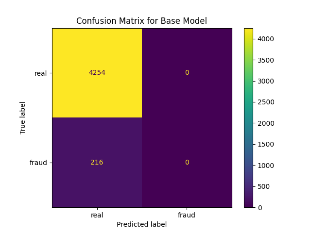

# Finding Fake Job Ads

As I get closer to applying for jobs, I am getting more and more fake jobs via messages, so I wondered how many job ads are fake?  And can I train a classification model to determine how likely a job ad is to for a fake job.  

If you are interested in exploring my model with job ads that you've found, please visit [my streamlit app](https://is-this-job-ad-fake.streamlit.app/) to test my model for yourself!

## Data Source, Cleaning, and Feature Extraction

The primary dataset is from [Kaggle](https://www.kaggle.com/datasets/shivamb/real-or-fake-fake-jobposting-prediction).  There are some other code posted.  I did not read these as it takes all the fun out of exploring on my own first.

This an interesting dataset, although it's from Kaggle, it's actually missing quite a few values (including an entry that's missing the job description!).  About 5% of the samples are fraudulent job ads.  

The job ad text is broken up between four columns, I concatenated the texts together for each entry to create a single text column.  

Many of the features are large categorical data with more than 20 unique values.  This would quickly create a massive number of features, so I ended up dropping most of the categorical columns.  I did keep the categorical features with less than 20 unique values.

## Base Model
Since 95% of the job ads are real, we could simply predict that all the job ads are for real jobs.  This gives us a base-model accuracy of 0.952. 

| Model | Accuracy | Precision | Recall | F1-score | ROC-AUC score |
| ----- | -------- | --------- | ------ | -------- | ------------- |
| Base  | 0.952    | 0.0       | 0.0    | 0.0      | 0.5           |

Thus our goal is to develop models that improve on these metrics.  In particular, we are going to focus on the F1-score.  Precision tells us how many of the ads predicted to be fraudulent are actually fraudulent, while recall (or sensitivity) tells us how many of the fraudulent ads we properly identified as fraudulent.  Ideally, we would flag only fraudulent ads and we would identify all of them.  

The F1-score is the harmonic mean of precision and recall and thus tries to optimize both of these values.  I discuss all of these metrics in detail in my [technical report](./code/2_model_exploration.ipynb).  

## Model Exploration

I explored many, many models, but here I will highlight the best performing of these models.

### Text Preprocessing
I used both the count vectorizer and the Tf-Idf Vectorizer to encode the text data.  

| Model       | Accuracy | Precision | Recall | F1-score | ROC-AUC score |
| ----------- | -------- | --------- | ------ | -------- | ------------- |
| Base        | 0.9517   | 0.0       | 0.0    | 0.0      | 0.5           |
| Log, CV     | 0.9852   | 0.8906    | 0.7917 | 0.8382   | 0.8934        |
| Log, Tf-Idf | 0.9828   | 0.8458    | 0.7870 | 0.8152   | 0.8899        |

So far, the model with the best F1-score is the count vectorizer text preparation with the logistic regression model.  

#### Stop Words

Not all words change the meaning of a sentence, some work as grammatical positioners.  These are words such as "a" and "the".  We can choose to exclude these words from the analysis.  These are referred to as _stop words_.  This is a _choice_ and the actual list of stop words is also a choice.  These choices can introduce bias into our results, so we need to make this decision carefully.  I discuss this further in my [technical report](./code/2_model_exploration.ipynb).

Let's see what happens when stop words are excluded from the analysis.  

UPDATE
| Model             | Accuracy | Precision | Recall | F1-score | ROC-AUC score |
| ----------------- | -------- | --------- | ------ | -------- | ------------- |
| Base              | 0.9517   | 0.0       | 0.0    | 0.0      | 0.5           |
| Log, CV           | 0.9852   | 0.8906    | 0.7917 | 0.8382   | 0.8934        |
| Log, CV, stop     | 0.9861   | 0.9140    | 0.7870 | 0.8458   | 0.8916        |
| Log, Tf-Idf       | 0.9828   | 0.8458    | 0.7870 | 0.8152   | 0.8899        |
| Log, Tf-Idf, stop | 0.9817   | 0.8350    | 0.7731 | 0.8029   | 0.8827        |

The best F1-score occurs when I ---------

### Logistic Regression

The most straightforward classifier is actually logistic regression.  It's actually still a linear regression and maintains the use interpretability of linear regression.  Instead of fitting a linear equation to the target variable, we instead fit a linear equation to the _logit_ or log odds:

$$ \log \left( \frac{p(X)}{1 - p(X)} \right) = \beta_0 + \sum_{i=1}^p \beta_i x_i $$

where $X$ is our feature matrix (containing $x_1, \dots, x_p$ features), $\beta_0$ is the vector intercept or _bias_ and $\beta_1$ is the vector "slope".  Please note that I'm using the standard $\log = \ln$ is the natural log and _not_ the base-10 log.   

#### Regularization

To decrease over-fitting, we can also use regularization where we add a penalty term to our loss function, let's refer to this function as $f_\text{loss}$.

$$ f_\text{loss, regularized} =  f_\text{loss, orginal} + \lambda \left\| \beta \right\|^i_i $$

where $i$ denotes the type of normalization.  Please note that sometimes $\alpha$ is used instead of $\lambda$.  In my code, you will also see the scikit-learn notation $C = 1/\alpha = 1/\lambda$.

| Name  | Penalty          | Distance           | Equation                                                         |
| ----- | ---------------- | ------------------ | ---------------------------------------------------------------- |
| LASSO | $\ell_1$ penalty | Manhatten distance | $\left\|\| \beta \right\|\|_1 = \sum_j \left\| \beta_j \right\|$ |
| Ridge | $\ell_2$ penalty | Euclidean distance | $\left\|\| \beta \right\|\|_2 = \sqrt{ \sum_j \beta_j^2 }$       |

If you want to calculate distance using a higher dimension, this is called a Minkowski distance.  However, this is not usually helpful because it is a weaker form of regularization.  

Ridge regularization shrinks our coefficients, $\beta_j$.  However, LASSO (Least Absolute Shrinkage and Selection Operator) actually zeros some of the coefficients.  Sadly, using either form of regularization makes our cofficients, $\beta_j$, uninterpretable since they are no longer just the "slopes" in our fit.

### Additional Models

I explored more models, but they did not perform as well (despite lengthy searches of the available parameter space).  So I will leave these models out of this summary.

<!--Multinomial and Complement Naive Bayes models.

### Random Forest

ran one model, grid searched

### Support Vector Machine (SVM) Models

### Stochastic Gradient Descent (SGD) Classifiers 

## DistilBERT Embedding and Fine-Tuning

At this point, it appears that the problem is less about the models and more about the target preparation.  So I moved to [DistilBERT](https://huggingface.co/distilbert/distilbert-base-uncased) contextual embedding.  DistilBERT is a smaller (just 67 million training parameters instead of BERT's 110 million training parameters) version of BERT.  It was introduced in this [paper](https://arxiv.org/abs/1910.01108).  If you really want to, you can read the truly gory details on the [distillation directory of transformers research projects GitHub](https://github.com/huggingface/transformers-research-projects/tree/main/distillation).  
-->

## Model Evaluation

SUMMARY / METRICS of models here.

## Streamlit App

## Conclusion

Surprisingly, sometimes the simpliest models are the most useful.  